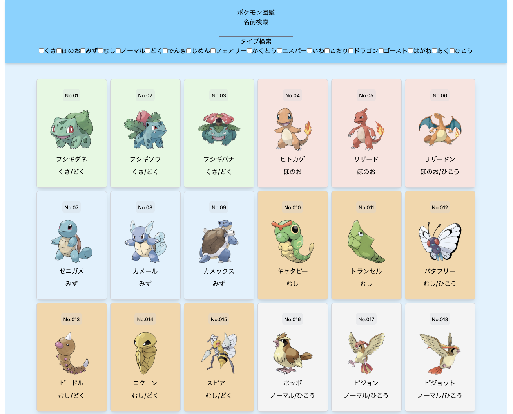

# プロジェクト名

プロジェクトの簡単な説明。  
簡易的なポケモン図鑑アプリです

---

## スクリーンショット
ホームページ画面


---
ポケモン詳細画面


---

## 主な機能

- ポケモン一覧取得
- ポケモン検索機能（リアルタイム）
    - 名前（テキスト）
    - タイプ（混合タイプ含み）
- レスポンシブ対応

---

## 使用技術

| フロントエンド | 
|----------------|
| React  | 
| Tailwind CSS    |

---

## スタート

```bash
# リポジトリをクローン
git clone https://github.com/Keita-0025/Pokemon-pictorial-book.git

# ディレクトリ移動
cd リポジトリ名

# 依存関係インストール
npm install

# 開発サーバー起動
npm run dev